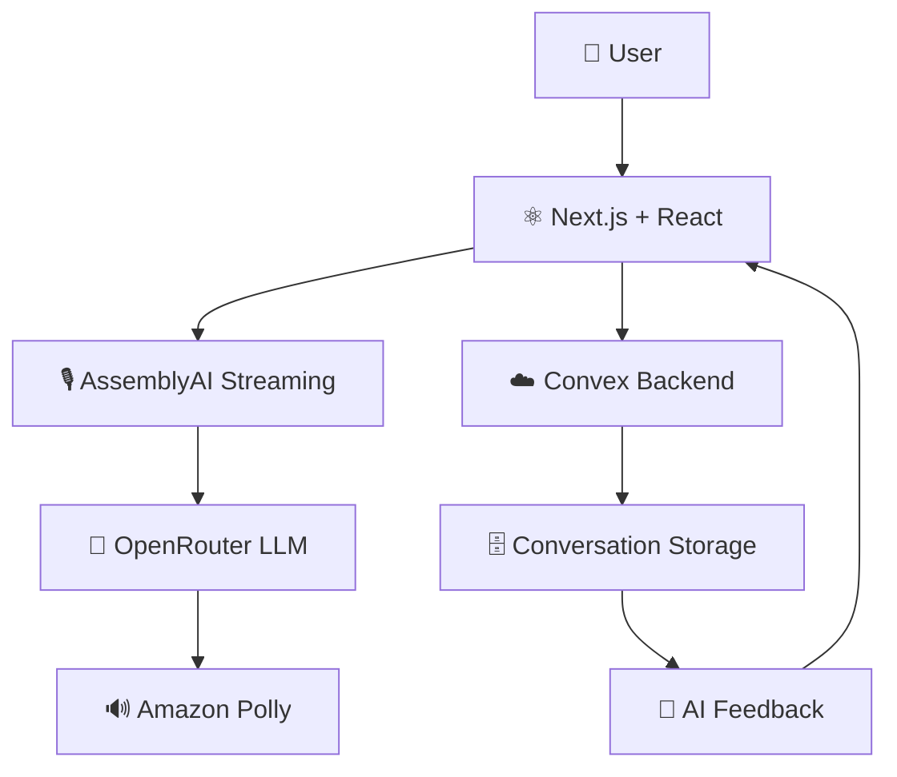

<div align="center">


### 🚀 Multi-Agent Voice AI Platform

### *Speak • Think • Learn • Improve*

<p>


</p>

### 🎤 Speech-to-Text • 🤖 AI Agents • 🔊 Text-to-Speech • 🎥 Webcam • 📝 AI Feedback

</div>

---

# 📖 Overview

**VoxAI** is a real-time AI-powered **Multi-Agent Voice Interaction Platform** that enables natural, human-like conversations with specialized AI agents using voice.

The platform combines **speech recognition, large language models, text-to-speech synthesis, webcam integration, persistent conversation history, and AI-generated feedback** to create an immersive learning and interview experience.

Whether you're preparing for interviews, improving communication skills, practicing a language, or learning new concepts, VoxAI delivers a seamless voice-first AI experience with ultra-low latency.

---

# ✨ Features

## 🎙️ Real-Time Speech Recognition

- Live Speech-to-Text
- Ultra-low latency streaming
- Continuous transcription
- WebSocket audio streaming
- High-accuracy speech recognition

---

## 🤖 AI Agents

| Agent | Purpose |
|-------|----------|
| 🎤 Mock Interview Agent | HR & Technical interview simulation |
| 🌍 Language Learning Agent | Improve pronunciation and communication |
| 💬 Discussion Coach | Interactive topic discussions |
| 📚 Learning Coach | Personalized AI learning guidance |
| ❓ General Q&A Agent | Intelligent knowledge assistant |
| 🧠 Feedback Agent | Session analysis and improvement suggestions |

---

## 🔊 AI Voice Responses

- Amazon Polly integration
- Natural human-like voices
- Automatic voice playback
- Multiple voice personalities

---

## 🎥 Interview Mode

- Webcam support
- Live microphone controls
- Real interview environment
- Professional interview UI

---

## 📝 AI Feedback

- Performance evaluation
- AI-generated session summary
- Personalized improvement suggestions
- Conversation history
- Learning notes

---

## ☁️ Cloud Powered

- Convex Backend
- Real-time synchronization
- Persistent storage
- Secure API Routes

---

# 🏗️ System Workflow

```mermaid
flowchart LR

A["🎤 User Speaks"]
B["🎙️ AssemblyAI Streaming API"]
C["📝 Live Speech Transcription"]
D["🧠 Conversation Context"]
E["🤖 OpenRouter LLM"]
F["💬 AI Response Generation"]
G["🔊 Amazon Polly TTS"]
H["🎧 AI Voice Playback"]
I["☁️ Convex Database"]
J["📊 AI Feedback & Session Summary"]

A --> B
B --> C
C --> D
D --> E
E --> F
F --> G
G --> H
H --> I
I --> J
```



---

# 🏛️ System Architecture



---

# 📸 Project Screenshots

## 🏠 Landing Page


---

## 📊 Dashboard


---

## 🎤 Mock Interview


---

## 🎥 Interview Interface


---

## 📝 AI Feedback


---

## 📈 Conversation Summary


---

# 🎥 Demo Videos

## 🎬 Complete Application Demo

> Add your GitHub video link here

---

## 🎤 Mock Interview Demo

> Add your GitHub video link here

---

## 🎥 Webcam Interview Demo

> Add your GitHub video link here

---

## 📝 AI Feedback Demo

> Add your GitHub video link here

---

# ⚙️ Technology Stack

## 💻 Frontend

- Next.js 15
- React 19
- Tailwind CSS
- Shadcn UI

---

## ⚙️ Backend

- Convex
- Next.js API Routes

---

## 🤖 Artificial Intelligence

- OpenRouter
- GPT-4o Mini

---

## 🎤 Speech Technologies

- AssemblyAI Streaming API
- Amazon Polly

---

## 🌐 Browser APIs

- Web Audio API
- MediaDevices API
- WebSocket API

---

# 📂 Project Structure

```text
📦 VoxAI
│
├── 📂 app
│   ├── 📂 api
│   │   ├── assembly-token
│   │   └── generate-feedback
│   │
│   ├── 📂 dashboard
│   ├── 📂 discussion-room
│   └── 📂 view-summary
│
├── 📂 components
│
├── 📂 convex
│
├── 📂 services
│
├── 📂 public
│   ├── 📄 logo.svg
│   └── 📂 screenshots
│
├── 📄 package.json
├── 📄 README.md
└── 📄 .env.local
```

---

# 🚀 Getting Started

## Clone Repository

```bash
git clone https://github.com/UdayKumarMaripelly/VoxAI-Multi-Agents-Voice-Platform.git
```

## Navigate to Project

```bash
cd VoxAI-Multi-Agents-Voice-Platform
```

## Install Dependencies

```bash
npm install
```

## Start Development Server

```bash
npm run dev
```

Open

```
http://localhost:3000
```

---

# 🔑 Environment Variables

Create a `.env.local`

```env
NEXT_PUBLIC_CONVEX_URL=

ASSEMBLY_API_KEY=

NEXT_PUBLIC_ASSEMBLY_API_KEY=

AI_OPENROUTER_KEY=

NEXT_PUBLIC_AI_OPENROUTER=

NEXT_PUBLIC_AWS_ACCESS_KEY_ID=

NEXT_PUBLIC_AWS_SECRET_KEY=
```

---

# 🌟 Future Enhancements

- 🎯 Resume-Based AI Interviews
- 💻 Live Coding Interview Agent
- 😊 Emotion Detection
- 🌍 Multi-language Conversations
- 📈 Performance Analytics Dashboard
- 📹 Interview Recording
- 🎙️ Voice Cloning
- 📱 Mobile Application
- 👥 Team Collaboration
- 📊 Progress Tracking

---

# 🤝 Contributing

Contributions are welcome!

1. Fork the repository
2. Create a new feature branch

```bash
git checkout -b feature-name
```

3. Commit your changes

```bash
git commit -m "Add new feature"
```

4. Push to GitHub

```bash
git push origin feature-name
```

5. Open a Pull Request

---

# 👨‍💻 Author

## Uday Kumar Maripelly

**B.Tech – Computer Science (Data Science)**

💡 AI • Full Stack • Java • Data Science

### GitHub

https://github.com/UdayKumarMaripelly

---

<div align="center">

## ⭐ If you found this project useful, consider giving it a Star!

**Built with ❤️ by Uday Kumar Maripelly**

</div>
